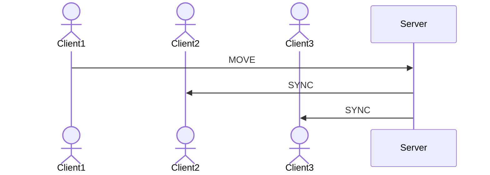

# Multiplayer architecture tutorial

The `Bonsai.ZeroMQ` package allows us to harness the powerful [ZeroMQ](https://zeromq.org/) library to build networked applications in Bonsai. Examples could include:
- Interfacing with remote experimental rigs via network messages
- Performing distributed work across pools of machines (e.g. for computationally expensive deep-learning inference) 
- Streaming video data between clients across a network
- **Real-time interaction between clients in a multiplayer game**

In this article, we will use Bonsai.ZeroMQ to explore this final example and build a basic client-server architecture similar to one that might be used in a multiplayer game.

## Network design
The basic network architecture we want to achieve will be composed of a number of clients sending their state to a server, which then updates the other connected clients with that clients’ state. This is comparable to a multiplayer game in which client players move through the game world and must synchronise that movement via a dedicated server so that all players see each other in their ‘true’ position in the world.

